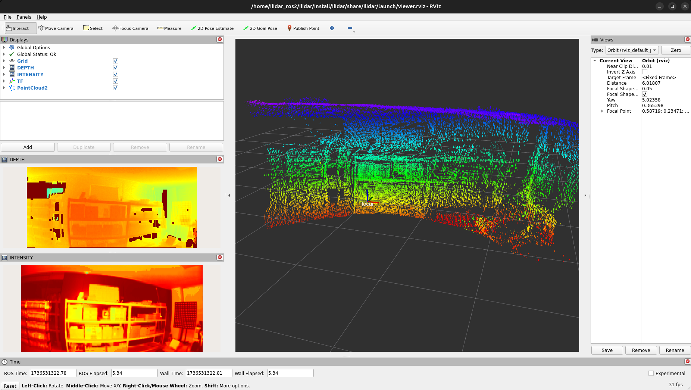

# Legacy Notice

> [!WARNING]
> This repository is now in **Legacy Maintenance Mode**.
>
> It is no longer under active development.
> Only critical bug fixes may be provided if required.
>
> **Please use the latest repositories instead:**
>
> - **ROS Driver**: https://github.com/ilidar-tof/ilidar-ros
>
> You can also find all actively maintained repositories on the organization page:
> https://github.com/ilidar-tof

# iLidar ROS Package
Ready to Use: This ROS1 package can be used to integrate our sensor into your application based on ROS1 environment. 

**Current Version is 1.3.2 (2025-04-30)**

## Overview
This package can read depth and intensity data from our sensor. Currently, the goal of this package is to read the data from iLidar-ToF:iTFS, and reconstruct them to the 3D point cloud with the basic camera model.

## ROS1 Requirement
ROS1 package (ilidar_ros) has been developed on `ROS noetic`. But we checked that this package can also be built on `ROS melodic` and `ROS kinetic`.
This package uses the following ROS dependencies (see details in package.xml):

```bash
rosconsole
roscpp
opencv
cv_bridge
image_transport
sensor_msgs
pcl_ros
pcl_conversions
```

## Development Environment
This repository has been built and tested with real sensors in the following environment:

|ROS Distribution|Docker Image|
|:--------------:|:-----------|
|ROS kinetic|osrf/ros:kinetic-desktop-full|
|ROS melodic|osrf/ros:melodic-desktop-full|
|ROS noetic|osrf/ros:noetic-desktop-full|

If you want to test the sensor on docker images, follow instructions in ROS-DOCKER.txt file.

## How to Build

After the installation ROS and its dependencies for building packages, call the catkin command
```
$ catkin_make
```
at the same directory with this README file. 


## Set Launch File

Open `/src/launch/viewer.launch` and set the following value.
```html
<param name="mapping_file"    type="string"     value="$(find ilidar)/src/iTFS-110.dat"   />
```
Use `value="$(find ilidar)/src/iTFS-110.dat"` for iTFS-110 or `"$(find ilidar)/src/iTFS-80.dat"` for iTFS-80.

## Launch

Launch the viewer with the command:
```bash
$ source ./devel/setup.bash
$ roslaunch ilidar viewer.launch 
```

## Example
When the sensor is working properly, the example display should look like:

  
You can see the depth and intensity images at below windows, which topics are published as 
```html
/ilidar/depth
/ilidar/intensity
```
and the reconstructed 3D cloud points are also shown at the main display with 'local' frame. The 3D points can be used with the topic:
```html
/ilidar/points
```

For gray scale mode, press Add > By topic > /gray/Image and check OK button. If you don't use 940 nm external IR light source, you will see almost nothing.
```html
/ilidar/gray
```

## Topic details

### /ilidar/depth

The depth image from the sensor. The data type of the image is "mono16" with mm-unit, when you configure "colormap" to "false". When you set "colormap" to "true", the data type will be "rgb8". This topic is published by image_transport::ImageTransport.

### /ilidar/intensity

The intensity image from the sensor. This topic has the same format with the depth image.

### /ilidar/points

The reconstructed point cloud from the sensor. The type of point is "pcl::PintXYZI". This topic is published by sensor_msgs::PointCloud2.

### /ilidar/gray

Gray image from the sensor. Valid only in mode 4. This topic is published by image_transport::ImageTransport.

## How to access the raw depth image

You can see the reception process in ilidar-ros.cpp as following:
```cpp
...
/* Main loop starts here */
int recv_device_idx = 0;
while (ros::ok()) {
	// Wait for new data
	std::unique_lock<std::mutex> lk(lidar_cv_mutex);
	lidar_cv.wait(lk, []{ return !lidar_q.empty(); });
	recv_device_idx = lidar_q.front();
	lidar_q.pop();

	/* ... */
}
```
After waiting `lidar_cv.wait()`, the raw depth data is stored at `lidar_img_data` which has the `mm` units. So, you can access the data in pixel as shown in the above.

## License
All example projects are licensed under the MIT License. Copyright 2022-Present HYBO Inc.

